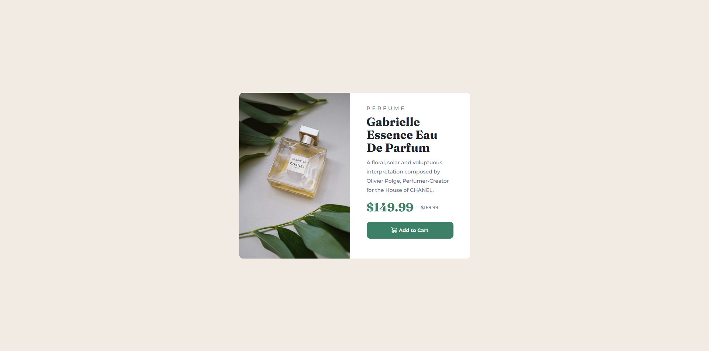

# Frontend Mentor - Product preview card component

This is a solution to the [Product preview card component challenge on Frontend Mentor](https://www.frontendmentor.io/challenges/product-preview-card-component-GO7UmttRfa).

## Table of contents

- [Frontend Mentor - Product preview card component](#frontend-mentor---product-preview-card-component)
  - [Table of contents](#table-of-contents)
  - [Overview](#overview)
    - [Screenshot](#screenshot)
    - [Links](#links)
  - [My process](#my-process)
    - [Built with](#built-with)
    - [What I learned](#what-i-learned)
    - [Continued development](#continued-development)
  - [Author](#author)

**Note: Delete this note and update the table of contents based on what sections you keep.**

## Overview

### Screenshot

    The desktop design VS My desktop solution
     
    
    

 

    The mobile design VS My mobile solution
     
    
    

### Links

- Solution URL: [Add solution URL here](https://your-solution-url.com)
- Live Site URL: [Add live site URL here](https://your-live-site-url.com)

## My process

### Built with

- Semantic HTML5 markup
- CSS custom properties
- Flexbox

### What I learned

I learn how to make a responsive design.

### Continued development

I want to continue making responsive components to incorporate them into other projects and someday make a fully responsive website.

## Author

- Frontend Mentor - [@Andresssg](https://www.frontendmentor.io/profile/Andresssg)